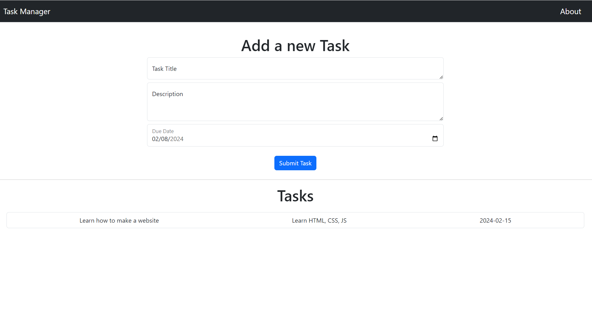

# Task Manager App

A simple Task Manager application built using ExpressJS, EJS, Vite, and Bootstrap.



## Features

- Create tasks with a title, description, and due date.
- View and manage your tasks in a user-friendly interface.
- This site is built with a responsive design, ensuring a seamless experience across various devices and screen sizes.

## Setup

1. Clone the repository:

   ```bash
   git clone https://github.com/sri-anya/TaskManagerUsingExpress
   ```
2. Install dependencies
   
   ```
   npm install
   ```
3. Run the application
    ```
    npm start
    ```
    The app will be accessible at http://localhost:3000.

## Demo
Check out the [demo](https://task-manager-create.glitch.me/) to see the Task Manager app in action!

## Technologies Used
- ExpressJS: A minimal and flexible Node.js web application framework.
- EJS: Embedded JavaScript templates for server-rendered views.
- Vite: A fast front-end build tool with blazing fast cold server start.
- Bootstrap: A popular CSS framework for building responsive and mobile-first websites.
## Usage
- Create a new task by navigating to the "Create Task" section.
- Fill in the task details such as title, description, and due date.
- Submit the form to add the task to the Task Manager.

## Badges

[](https://nodejs.org/)
[](https://expressjs.com/)
[](https://ejs.co/)
[](https://vitejs.dev/)
[](https://getbootstrap.com/)
